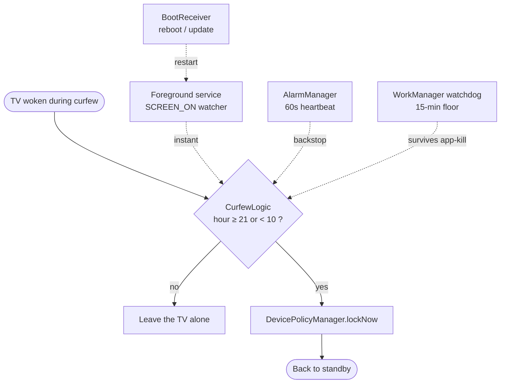

<div align="center">

# 🌙 TV Curfew

### ❤️🎈 &nbsp;*Build with heart. Rise with purpose.*

**An Android TV app that forces the TV into standby whenever anyone turns it on between 9:00 PM and 10:00 AM — no warning, no prompt.**

[](#)
[](#)
[](#)
[](#)
[](LICENSE)

[](https://github.com/tatavarthitarun/tv-curfew/releases/latest/download/tv-curfew.apk)

</div>

---

## What it does

Anyone turns the TV on during the curfew window → it drops straight back to standby. Instantly. No dialog,
no countdown, nothing to dismiss. Outside the window it never touches the TV.

> **The one hard truth:** Android has **no public API to fully power a device off** — real `SHUTDOWN`/`REBOOT`
> are `signature|privileged` permissions granted only to platform-signed system apps or root. So "shut down"
> here means **DeviceAdmin → `lockNow()` → standby (screen off)**, exactly what the remote's power button does,
> paired with an instant re-lock on every wake. No root required. *(If your TV is rooted, swap `lockNow()` for
> `su -c reboot -p` for a genuine power-off.)*

---

## How it works



Four independent layers make it *"no matter what"*:

| Layer | File | Role |
|------|------|------|
| ⚡ **Instant re-lock** | `CurfewService.kt` | Foreground service holds a runtime `ACTION_SCREEN_ON` receiver; any wake during curfew → `lockNow()`. |
| 🕐 **60s heartbeat** | `CurfewAlarmReceiver.kt` | Exact alarm re-arms every 60s inside the window; sleeps to next 9 PM otherwise. |
| 🔄 **Survives reboot** | `BootReceiver.kt` | Restarts everything on `BOOT_COMPLETED` / `MY_PACKAGE_REPLACED`. |
| 🛡️ **Kill-resistant watchdog** | `CurfewWorker.kt` | WorkManager job (persists across app-death + reboot) re-locks and re-arms if an OEM kills the app. |

The single decision point is `CurfewLogic.isCurfew()` → `hour >= 21 || hour < 10`, window `[21:00, 10:00)`.

---

## Install on your Android TV

**Option A — one-tap download:** grab the [**latest APK**](https://github.com/tatavarthitarun/tv-curfew/releases/latest/download/tv-curfew.apk) and sideload it *(debug-signed — fine for personal use)*.

**Option B — via ADB.** Enable *Developer options → Network debugging* on the TV, then from your computer on the same network:

```bash
adb connect <TV-IP>:5555
adb install -r tv-curfew.apk
# grant the lock permission — works from adb shell, no root needed:
adb shell dpm set-active-admin com.tatav.tvcurfew/.CurfewAdminReceiver
adb shell am start-foreground-service com.tatav.tvcurfew/.CurfewService
```

Or just open the **TV Curfew** app and tap its two setup buttons. Then it runs headless forever.

**Uninstall later:**
```bash
adb shell dpm remove-active-admin com.tatav.tvcurfew/.CurfewAdminReceiver
adb uninstall com.tatav.tvcurfew
```

---

## Build from source

```bash
./gradlew :app:assembleDebug        # → app/build/outputs/apk/debug/app-debug.apk
./gradlew :app:testDebugUnitTest    # 9 unit tests over the 9 PM–10 AM boundary
```
Toolchain: Kotlin · Gradle 8.13 · AGP 8.9 · minSdk 21 / target 34. Only runtime dependency is AndroidX WorkManager.

**Change the hours** in one place — `START_HOUR` / `END_HOUR` in [`CurfewLogic.kt`](app/src/main/java/com/tatav/tvcurfew/CurfewLogic.kt) — then rebuild.

---

## Verified

Tested live on an Android TV emulator (API 34) with the clock inside the curfew window:

- Service start → `lockNow()` → `mWakefulness=Asleep` ✅
- Woke the TV → `SCREEN_ON` → `lockNow()` → back to `Asleep` in ~4s ✅
- Watchdog registered in the system JobScheduler: `JOB … com.tatav.tvcurfew/…SystemJobService … RUNNABLE` ✅
- 9/9 unit tests pass (both curfew and allowed branches) ✅

📖 Full illustrated walkthrough — the constraint, architecture, and every command with its real output — is in
**[`EXPLAINER.html`](EXPLAINER.html)** ([open rendered](https://htmlpreview.github.io/?https://github.com/tatavarthitarun/tv-curfew/blob/main/EXPLAINER.html)).

---

## Limitations

- **Standby, not a true power-cut.** Impossible without root; behaves like the power button.
- **Uses the device clock** — if someone changes the TV's time, the window shifts with it.
- **Aggressive OEM power managers** are handled by the watchdog (worst-case re-lock ~15 min if the whole app is
  killed; instant otherwise). If a vendor is extreme, also whitelist the app from battery optimization.

---

<div align="center">

*Personal utility. Not intended for the Play Store.*

**— ❤️🎈**

</div>
